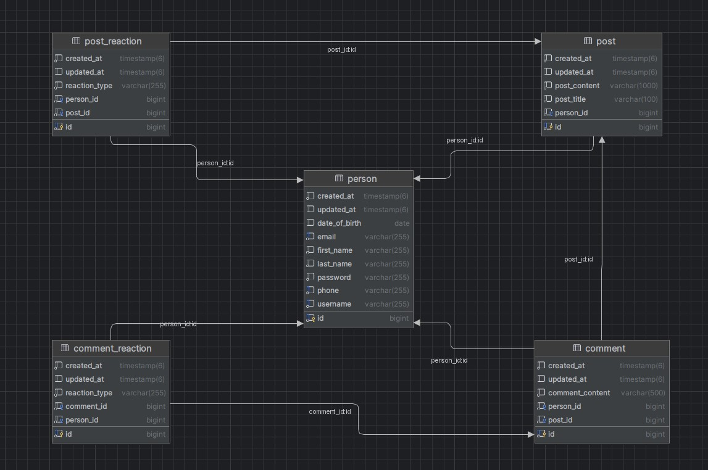

# Social Media Platform

## Introduction

This project is a social media application where users can interact through posts, comments, and reactions. Users can create accounts, share posts, comment on others' posts, and react to content. The system ensures data security and allows users to manage their own data.

The project is built using Java 17 and Spring Boot version 3.3.2, leveraging various Spring modules such as Spring Data JPA for database interaction, Hibernate as the ORM framework, and other technologies like Jakarta Validation API, and PostgreSQL. Lombok is used to reduce boilerplate code.

Spring Security will be added in the future to enhance the application's security.

As a computer engineering student, I created this small project to reinforce what I have learned and to explore new concepts.

## Diagram

# API Endpoints

## User Endpoints

- **POST /api/people**
  - **Description:** Creates a new person.
  - **Request Body:** `PersonRequestDTO`
  - **Response:** `PersonResponseDTO`

- **GET /api/people/{id}**
  - **Description:** Retrieves a person by ID.
  - **Path Parameter:** `id` (Long)
  - **Response:** `PersonResponseDTO`

- **GET /api/people/all**
  - **Description:** Retrieves a list of all people.
  - **Response:** `List<PersonListResponseDTO>`

- **DELETE /api/people/{id}**
  - **Description:** Deletes a person by ID.
  - **Path Parameter:** `id` (Long)

- **PUT /api/people/{id}/username**
  - **Description:** Updates the username of a person.
  - **Path Parameter:** `id` (Long)
  - **Request Body:** `UpdateUsernameRequestDTO`
  - **Response:** `String` (Success Message)

- **PUT /api/people/{id}/email**
  - **Description:** Updates the email of a person.
  - **Path Parameter:** `id` (Long)
  - **Request Body:** `UpdateEmailRequestDTO`
  - **Response:** `String` (Success Message)

- **PUT /api/people/{id}/password**
  - **Description:** Updates the password of a person.
  - **Path Parameter:** `id` (Long)
  - **Request Body:** `UpdatePasswordRequestDTO`
  - **Response:** `String` (Success Message)

## Post Endpoints

- **POST /api/posts**
  - **Description:** Creates a new post.
  - **Request Body:** `PostRequestDTO`
  - **Response:** `PostResponseDTO`

- **GET /api/posts/{postId}**
  - **Description:** Retrieves a post by ID.
  - **Path Parameter:** `postId` (Long)
  - **Response:** `PostResponseDTO`

- **GET /api/person/{personId}/posts**
  - **Description:** Retrieves all posts by a specific person.
  - **Path Parameter:** `personId` (Long)
  - **Response:** `List<PostResponseDTO>`

- **PATCH /api/posts/{postId}/title**
  - **Description:** Updates the title of a post.
  - **Path Parameter:** `postId` (Long)
  - **Request Body:** `UpdateTitleRequestDTO`
  - **Response:** `PostResponseDTO`

- **PATCH /api/posts/{postId}/content**
  - **Description:** Updates the content of a post.
  - **Path Parameter:** `postId` (Long)
  - **Request Body:** `UpdateContentRequestDTO`
  - **Response:** `PostResponseDTO`

- **DELETE /api/posts/{postId}**
  - **Description:** Deletes a post by ID.
  - **Path Parameter:** `postId` (Long)

## Comment Endpoints

- **POST /api/comments/{postId}**
  - **Description:** Creates a new comment on a specific post.
  - **Path Parameter:** `postId` (Long)
  - **Request Body:** `CommentRequestDTO`
  - **Response:** `CommentResponseDTO`

- **GET /api/comments/{commentId}**
  - **Description:** Retrieves a comment by ID.
  - **Path Parameter:** `commentId` (Long)
  - **Response:** `CommentResponseDTO`

- **PATCH /api/comments/{commentId}**
  - **Description:** Updates a comment.
  - **Path Parameter:** `commentId` (Long)
  - **Request Body:** `CommentRequestDTO`
  - **Response:** `CommentResponseDTO`

- **DELETE /api/comments/{commentId}**
  - **Description:** Deletes a comment by ID.
  - **Path Parameter:** `commentId` (Long)

## Reaction Endpoints

### Post Reactions

- **POST /api/posts/{postId}/reactions**
  - **Description:** Creates a new reaction to a post.
  - **Path Parameter:** `postId` (Long)
  - **Request Body:** `ReactionRequestDTO`
  - **Response:** `ReactionResponseDTO`

- **PATCH /api/posts/{postId}/reactions**
  - **Description:** Updates a reaction on a post.
  - **Path Parameter:** `postId` (Long)
  - **Request Body:** `ReactionRequestDTO`
  - **Response:** `ReactionResponseDTO`

- **DELETE /api/posts/{postId}/reactions/{reactionId}**
  - **Description:** Deletes a reaction on a post.
  - **Path Parameter:** `postId` (Long), `reactionId` (Long)

### Comment Reactions

- **POST /api/comments/{commentId}/reactions**
  - **Description:** Creates a new reaction to a comment.
  - **Path Parameter:** `commentId` (Long)
  - **Request Body:** `ReactionRequestDTO`
  - **Response:** `ReactionResponseDTO`

- **PATCH /api/comments/{commentId}/reactions**
  - **Description:** Updates a reaction on a comment.
  - **Path Parameter:** `commentId` (Long)
  - **Request Body:** `ReactionRequestDTO`
  - **Response:** `ReactionResponseDTO`

- **DELETE /api/comments/{commentId}/reactions/{reactionId}**
  - **Description:** Deletes a reaction on a comment.
  - **Path Parameter:** `commentId` (Long), `reactionId` (Long)

  
